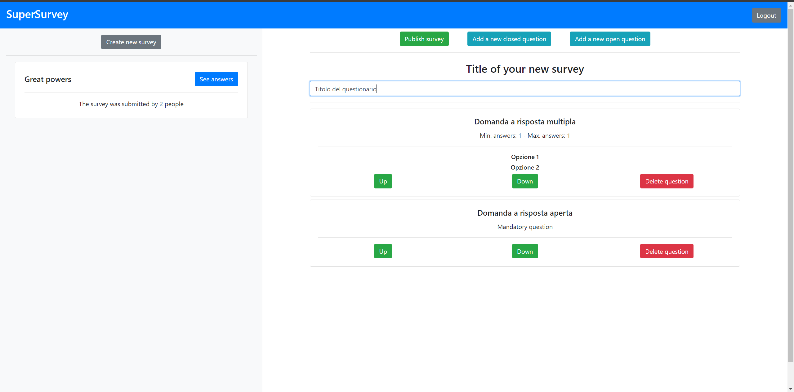

# Exam 1: "Questionario"
## Student: s287028 Inzerillo Gabriele 

## React Client Application Routes

- Route `/homepage`: nella homepage sono visualizzati tutti i questionari. La homepage è la route di "default" per gli utenti che non sono loggati.
- Route `/admin`: route nella quale viene visualizzato il componente "AdminDashboard" e i relativi componenti figli. Rappresenta la schermata principale per un utente loggato, cioè un admin.

## API Server

- POST `/api/login`: serve ad effettuare il login.
  - request parameters and request body content
    - credentials = {username, password}: oggetto che contiene username e password dell'utente che vuole effettuare il login.
  - response body content
    - admin = {id, username}: oggetto che contiene username dell'admin loggato e il suo id, nel caso in cui il login sia andato a buon fine. Altrimenti conterrà un messaggio di errore.
- GET `/api/sessions/current`: serve a controllare se la sessione corrente è ancora attiva e chi è l'utente loggato.
  - request parameters and request body content
    - Nulla.
  - response body content
    - user = {id, username}: oggetto che contiene username e id dell'admin loggato. Altrimenti conterrà un messaggio di errore. Serve a mantenere la sessione di un utente.
- DELETE `/api/logout`: serve ad effettuare il logout.
  - request parameters and request body content
    - Nulla.
  - response body content
    - Nulla.
- GET `/api/surveys`: serve a prendere tutti i questionari del sito per visualizzarli nella homepage.
  - request parameters and request body content
    - Nulla.
  - response body content
    - surveys: array che al suo interno contiene oggetti che rappresentano i questionari caricati nel sito. Di seguito la struttura di ogni elemento dell'array surveys.
      - { id, title, adminId, author}
        - id: id del questionario.
        - title: titolo del questionario.
        - adminId: id dell'admin che ha creato il questionario.
        - author: username dell'admin che ha creato il questionario.
- GET `/api/survey=:survey`: serve a prendere tutte le domande di uno specifico questionario dato il suo id.
  - request parameters and request body content
    - survey: id del questionario che vogliamo prendere.
  - response body content
    - questions: array che al suo interno contiene oggetti che rappresentano le domande di uno specifico questionario. Si noti che, data una domanda a risposta multipla, nell'array ci saranno, solo per essa, tanti oggetti quante sono le risposte (options) della domanda stessa; mentre nel caso di una domanda a risposta aperta vi sarà un solo oggetto nell'array relativo ad essa. Di seguito la struttura di ogni elemento dell'array questions.
      - {questionId, questionText, type, min, max, optionId, optionText}
        - questionId: id della domanda.
        - questionText: testo della domanda.
        - type: tipo della domanda. Può essere 0, 1 o 2. 0 corrisponde a domanda a risposta multipla, 1 a risposta aperta obbligatoria, 2 a risposta aperta non obbligatoria.
        - min: minimo numero di risposte che un utente deve selezionare (valido solo per domande di tipo 0, ovvero a risposta multipla).
        - max: massimo numero di risposte che un utente può selezionare (valido solo per domande di tipo 0, ovvero a risposta multipla).
        - optionId: id della opzione. Per opzione si intenda, qualora la domanda fosse a risposta multipla, una delle possibili risposte selezionabili.
        - optionText: testo della opzione.
- POST `/api/user`: serve a creare un nuovo user (utente che ha compilato un questionario).
  - request parameters and request body content
    - name: nome dell'utente che ha compilato il questionario.
  - response body content
    - userId: id dell'utente che ha compilato il questionario. Ottenuto dopo aver inserito un nuovo user (di nome *name*) nel db.
- POST `/api/survey`: serve ad salvare le risposte che uno user ha dato ad un questionario 
  - request parameters and request body content
    - answerTemp: array che contiene le risposte date da un certo user ad un certo questionario. Ogni elemento di questo array ha una specifica struttura, analizzata di seguito.
      - {answerText, questionId, optionId, userId}
        - answerText: risposta testuale data ad una domanda a risposta aperta. Questo campo è presente (diverso da null) solo se la risposta si rifà ad una domanda a risposta multipla.
        - questionId: id della domanda alla quale si ha risposto.
        - optionId: id della opzione (risposta) selezionata nel caso in cui la domanda a cui si rifà fosse a risposta multipla. Nel caso in cui uno utente abbia selezionato più opzioni (risposte) in una domanda a risposta multipla, nell'array answerTemp, troveremo due oggetti con questioId e userId uguali ma optionId diversi, a dimostrare la scelta di più opzioni diverse nella stessa domanda.
        - userId: id dell'utente che ha risposto alla domanda.
  - response body content
    - Nulla.
- GET `/api/admin=:admin`: serve a prendere tutti i questionari che ha creato un certo admin, dato il suo id.
  - request parameters and request body content
    - admin: id dell'admin di cui si vogliono ottenere i questionari.
  - response body content
    - surveys: array contenente i sondaggi creati dall'admin. Ogni elemento di questo array ha una specifica struttura, analizzata di seguito:
      - {id, title, submissions}
        - id: id del questionario.
        - title: titolo del questionario.
        - submissions: numero di volte in cui il questionario è stato compilato correttamente.
- POST `/api/admin=:admin/survey`: serve a inserire nel db (specificatamente nella tabella SURVEY) il titolo di un nuovo questionario e l'id dell'admin che l'ha creato. 
  - request parameters and request body content
    - admin: id dell'admin che sta creando il questionario.
    - title: titolo del questionario.
  - response body content
    - surveyId: id del sondaggio appena creato, ottenuto dopo avere eseguito l'inserimento nel database del nuovo questionario.
- POST `/api/admin/survey/questions`: serve a inserire nel db tutte le domande relative al questionario appena creato con la precedente API.
  - request parameters and request body content
    - id: id del questionario appena creato. Lo otteniamo come risposta della precedente API (surveyId).
    - questions: array contenente le domande appartenenti al sondaggio appena creato. Gli elementi di questo array hanno una precisa struttura, che analizzo di seguito.
      - text: testo della domanda.
      - type: tipo della domanda. Può essere 0, 1 o 2. 0 corrisponde a domanda a risposta multipla, 1 a risposta aperta obbligatoria, 2 a risposta aperta non obbligatoria.
      - options: array che contiene le opzioni (risposte) della domanda, valido SOLO nel caso in cui la domanda inserita fosse di tipo 0 (risposta multipla). Viceversa contiene *null*.
      - max: massimo numero di risposte che un utente può selezionare (valido solo per domande di tipo 0, ovvero a risposta multipla). Viceversa contiene *null*.
      - min: minimo numero di risposte che un utente deve selezionare (valido solo per domande di tipo 0, ovvero a risposta multipla). Viceversa contiene *null*.
  - response body content
    - Nulla.
- GET `/api/survey=:survey/users`: serve a ottenere una lista di utenti che hanno compilato un certo questionario, dato il suo id.
  - request parameters and request body content
    - survey: id del questionario di cui si vuole ottenere la lista di utenti che lo ha compilato.
  - response body content
    - users: array che contiene la lista di utenti che hanno compilato il questionario. Ogni elemento dell'array contiene oggetti con una specifica struttura che analizzo di seguito.
      - {id, name}
        - id: id dell'utente.
        - name: nome dell'utente.
- GET `/api/survey=:survey/user=:user`: serve a ottenere le risposte che un certo utente ha dato ad un certo questionario, dati gli id sia dell'utente che del questionario. 
  - request parameters and request body content
    - user: id dell'utente che ha compilato il quesationario.
    - survey: id del questionario di cui cerchiamo le risposte.
  - response body content
    - submission: array che contiene le risposte date dall'utente di id *user* al questionario di id *survey*. Ogni elemento di questo array ha una specifica struttura che analizzo di seguito:
      - questionId: id della domanda a cui l'utente ha risposto (o non risposto).
      - answerText: testo della risposta data dall'utente. Il contenuto di questo campo sarà valido solo nel caso di domande a risposta aperta.
      - optionId: id della opzione (risposta) data dall'utente ad una domanda a risposta multipla. Nel caso in cui l'utente avesse selezionato più risposto vi sarebbero più elementi con la stessa questionId (stessa domanda) ma diversi optionId (diverse risposte date dall'utente). 

## Database Tables

- Table `ADMIN` - contains id, username, password. Contiene gli admin della web app
- Table `SURVEY` - contains id, title, adminId. Contiene i questionari caricati e una reference all'admin che li ha creati
- Table `QUESTION` - contains id, text, type, minAns, maxAns, surveyId. Contiene le domande presenti nei questionari. Il campo type può avere 3 possibili valori (0, 1, 2) che servono rispettivamente a distinguere tra domanda a risposta multipla, domanda aperta obbligatoria e domanda aperta non obbligatoria. minAns e maxAns sono utilizzate per tenere traccia del numero minimo e massimo di risposte selezionabili in quella domanda (solo nel caso di domande a risposta multipla).
- Table `OPTION` - contains id, description, questionId. La tabella serve a rappresentare e contenere le risposte per le domande a risposta multipla. Description è il testo della risposta, il questionId serve a fare riferimento alla domanda a cui appartengono.
- Table `ANSWER`- contains id, answerText, questionId, optionId, userId. La seguente tabella serve a salvare le risposte date alle domande dei questionari. Il campo answerText contiene la risposta (testuale) data alle domande aperte. questionId serve a capire a quale domanda, la tupla, fa riferimento. optionId invece serve a fare riferimento alla risposta (OPTION) scelta/e nel caso di domande a risposta multipla. Infine userId serve a riferirsi all'utente che ha dato quella risposta
- Table `USER`- contains id, name. Questa tabella serve a tenere solamente traccia degli utenti che compilano i questionari. È stato necessario creare una tabella (con propria PK) in quanto senza di essa, se ci fossero stati due utenti con lo stesso nome, a compilare lo stesso questionario, non sarebbe stato possibile distinguerli. Il che risulta, chiaramente, socrretto.

## Main React Components

- `NavigationBar` (in `NavigationBar.js`): questo componente rappresenta la barra di navigazione principale della Web Application. Nella parte sinistra del componente si trova il "logo" della WebApp e sulla destra un bottone di login/logout che cambia in funzione del fatto che sia stato eseguito o meno un login da un admin.
- `AdminDashboard.js` (in `AdminDashboard.js`): componente che rappresenta la "homepage" dell'admin. Tramite questo componente l'admin può decidere se creare un nuovo sondaggio o vedere i risultati dei sondaggi da lui creati (che appariranno listati).
- `ClosedQuestion.js` (in `ClosedQuestion.js`): componente renderizzato in fase di compilazione di un sondaggio da parte di un utente. Serve a rappresentare e modellare una domanda a risposta multipla. Gestisce la validazione (es: il numero di risposte date sia compreso tra min e max).
- `ModalLogin.js` (in `ModalLogin.js`): semplice componente usato per rappresentare un modal per il login. Gestisce la validazione delle credenziali di accesso.
- `ModalQuestion.js` (in `ModalQuestion.js`): componente utilizzabile solo dall'admin. Utilizzato in fase di creazione di un nuovo questionario per aggiungere nuove domande a risposta aperta e/o a risposta multipla. Nel caso delle domande a risposta multipla permette anche l'aggiunzione delle relative risposte previste (OPTION del database). Gestisce la validazione delle domande.
- `ModalSurvey.js` (in `ModalSurvey.js`): componente che modella un questionario da compilare. Permette all'utente di inserire il proprio nome e scegliere le risposte del questionario che ha selezionato. Una volta submittato il questionario, tramite API, invia le risposte scelte al database.
- `OpenQuestion.js` (in `OpenQuestion.js`): componente renderizzato in fase di compilazione di un sondaggio da parte di un utente. Serve a rappresentare e modellare una domanda a risposta aperta.
- `QuestionList.js` (in `QuestionList.js`): componente utilizzabile solo da un admin. Viene visualizzato nel momento in cui l'admin decide di creare un nuovo sondaggio. Serve a visualizzare e renderizzare la lista di domande che l'admin ha creato per il proprio (nuovo) questionario. Serve anche a gestire la cancellazione di una domanda creata per il questionario, ma anche per cambiare l'ordine delle domande nel questionario. Ovviamente tutto ciò prima che il questionario venga pubblicato.
- `Results.js` (in `Results.js`): questo componente viene visualizzato e utilizzato solo da un amdin. Viene creato nel momento in cui l'admin decide di vedere i risultati di un sondaggio da lui creato. Al suo interno viene visualizzato il nome dell'utente (di cui si stanno visualizzando le risposte) e il questionario con le risposte date dall'utente. Oltre a ciò sono presenti due tasti per potere andare "avanti" e "indietro" scorrendo i vari utenti che hanno risposto al sondaggio e le relative risposte.
- `SurveyPreview` (in `SurveyPreview.js`): card cliccabile, visualizzabile dentro il componente SurveysList, che contiene nome e autore di un questionario. Viene gestita in maniera differente in base al fatto che a visualizzarla sia un semplice user o un admin. Nel caso degli user contiene un bottone "Fill out" cliccabile che serve ad aprire il questionario (ModalSurvey) e a compilarlo. Nel caso dell'admin invece serve a visualizzare il numero di utenti che hanno rispsoto a quel questionario e contiene un bottone "See results" che una volta cliccato permette di visualizzare le risposte che sono state date a quel sondaggio.
- `SurveysList` (in `SurveysList.js`): componente che contiene tutti i questionari creati (come componenti "SurveyPreview"). Visualizzandola come "user" vi troveremo la lista di tutti i questionari creati e pubblicati fino ad ora. Visualizzandola come "admin" vi troveremo la lista di questionari da noi creati.

## Screenshot

## Users Credentials

- BruceWayne, BruceWayne (ha creato il questionario "The Dark Knight")
- PeterParker, PeterParker (ha creato il questionario "Great Powers")
